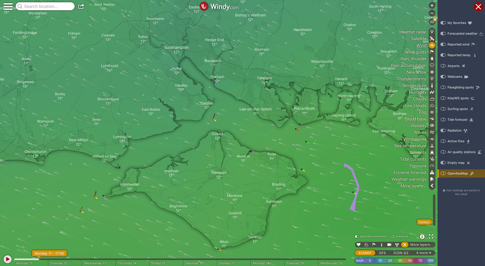
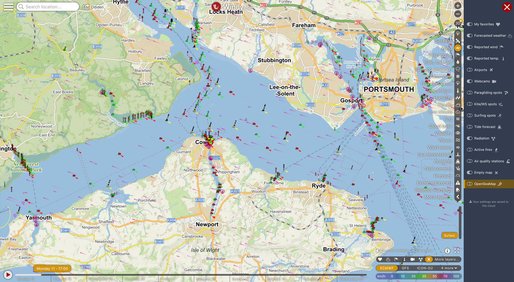

# OpenSeaMap nautical markers for Windy.com

Windy plugin for displaying nautical markers from OpenSeaMap (https://www.openseamap.org).

## Usage
The plugin is available only for the desktop version of Windy.

Open the *Menu* and select *Install Windy plugin*. 

In the *Windy plugins* menu, select *Load plugin directly from npm* and then enter the plugin code ***windy-plugin-openseamap***. 

Nautical markers are displayed from zoom level 9.

## Screenshots

### Wider view

### Detailed view

## Changelog
### V0.1.2
Fixed an issue where the map would become invisible when measuring distance.

### V0.1.1
Readme update

### V0.1.0
Initial release
