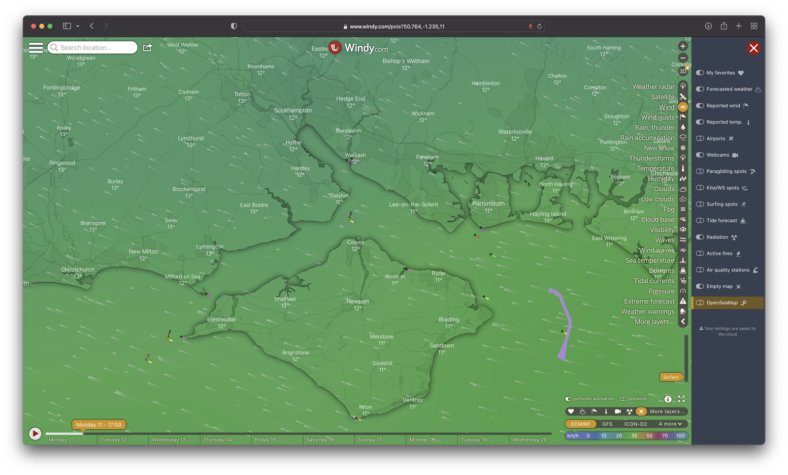
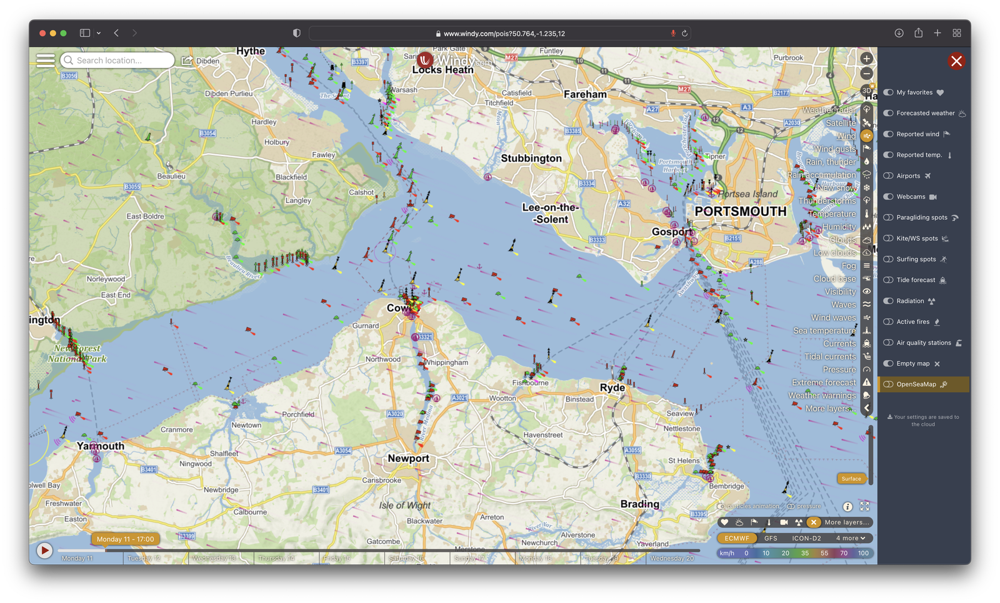

# OpenSeaMap nautical markers for Windy.com

Windy plugin for displaying nautical markers from OpenSeaMap (https://www.openseamap.org).

Nautical markers are displayed from zoom level 9.

### Wider view

### Detailed view

### Changelog
#### V0.1.0
Initial release
